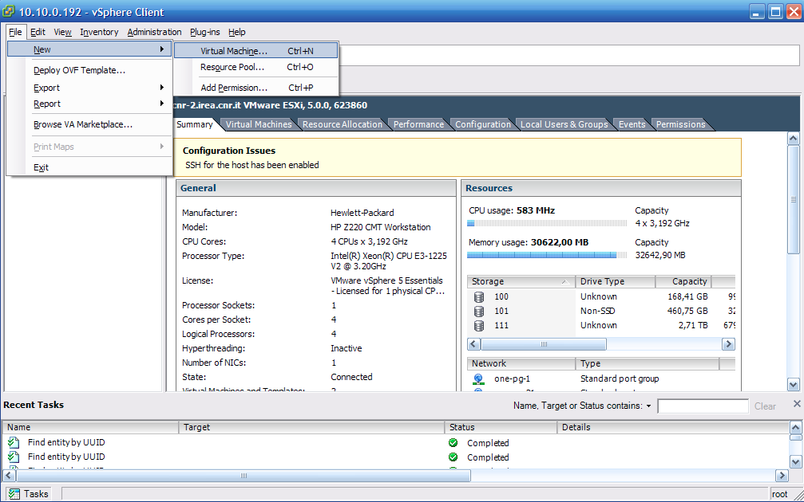
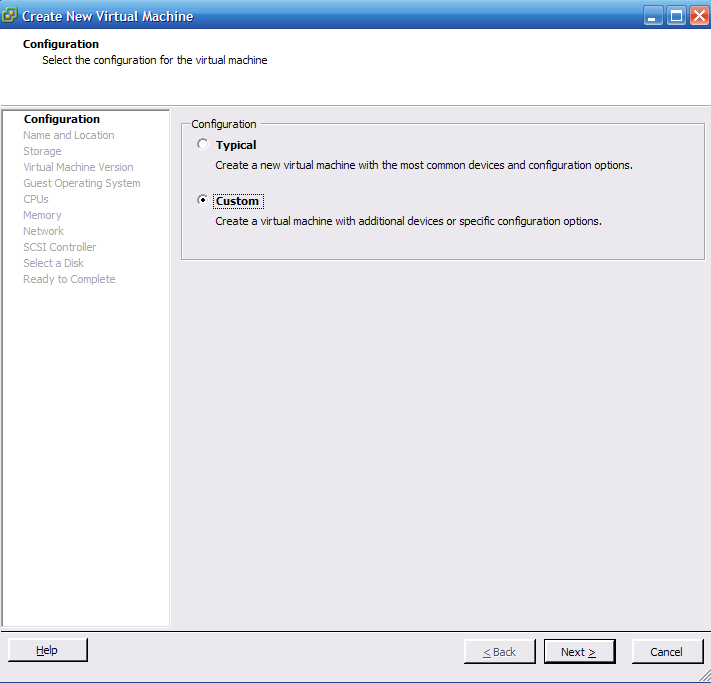
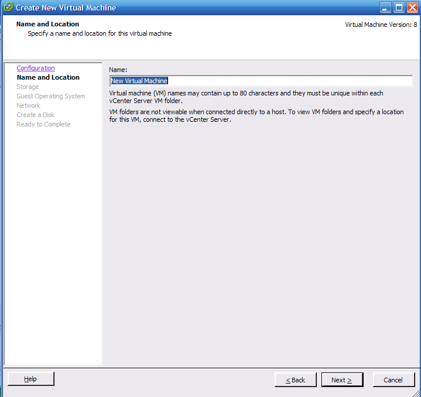
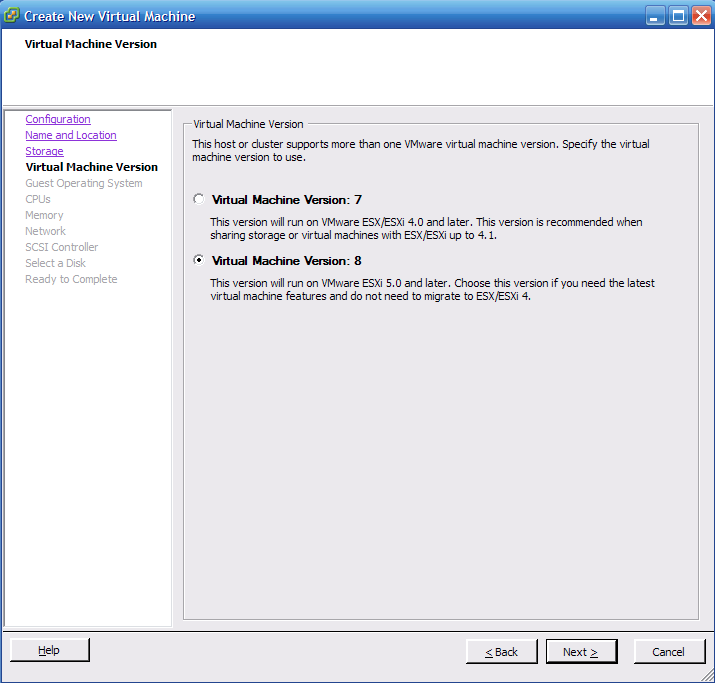
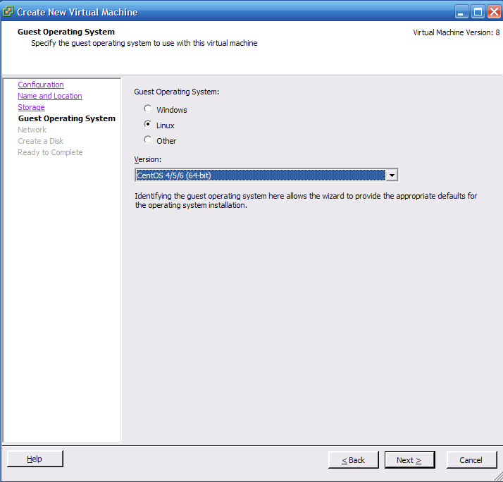
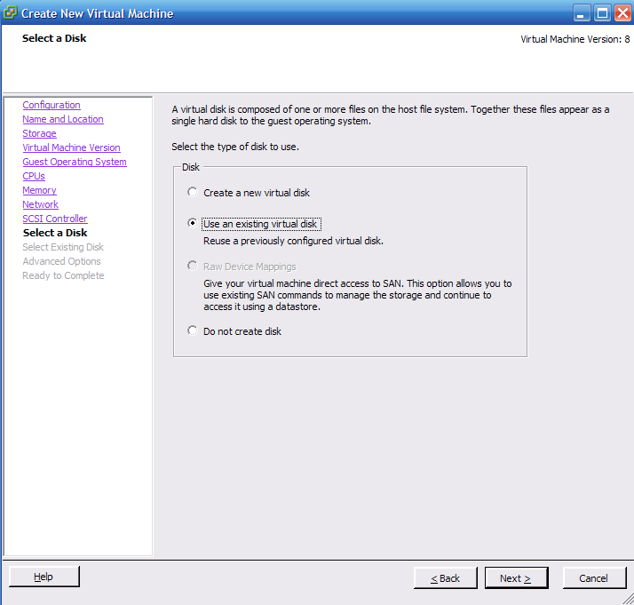
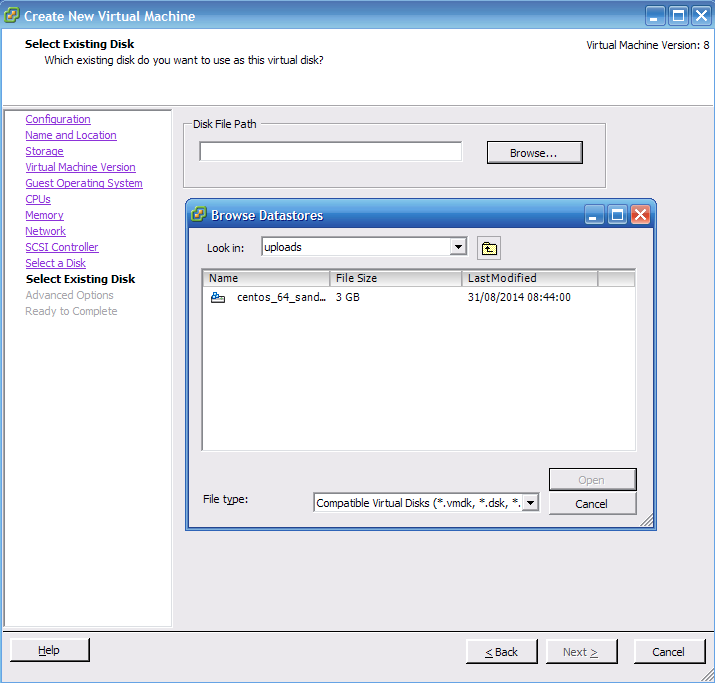
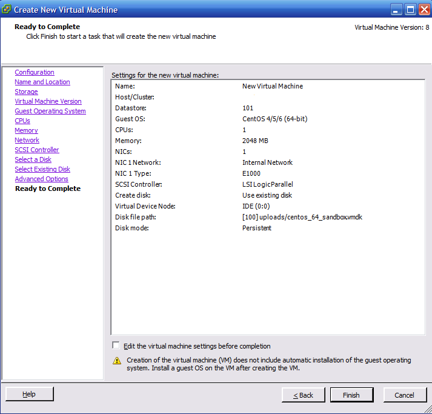
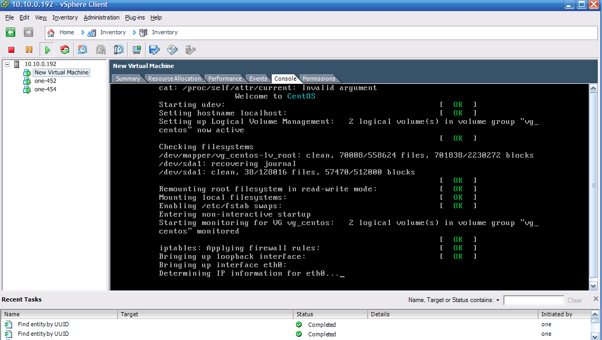

How to export a Terradue's Developer Cloud Sandbox to VMware ESXi 5.x
=====================================================================

Intended audience
-----------------

Anyone has the technical background to interact with *nix systems, BASH language, command line interfaces (CLI) and common network communication protocols.

Prerequisites
-------------

* To have root/admin permissions on the Sandbox,
* To have root/admin access to an ESXi 5.x installation,
* To have installed the [qemu-img](http://wiki.qemu.org/Main_Page) tool for manipulating disk images.

Step 1. Preparation of the Sandbox
----------------------------------

This step prepares your Sandbox in terms of OS configuration. Furthermore it makes the OS and the Application disks a single one disk (i.e. it copies all the content of the */application* mount point in the */* mount point). Before to start, please make sure that:

- The */application* contains only the needed stuff to be executed in Cluster mode (i.e. it is clean), 
- The */* has enough space to contain all the data of the */application* (If not, please contact the Operations Support  Team at Terradue).

If the previous facts are verified, proceed with the following steps:

* Login into the Sandbox,
* Copy the content of the folder *resources/scripts* in a directory you prefer,
* Type:
```bash
$ sh ./resources/scripts/ciop-sandbox-prepare.sh
```

Step 2. Snapshot of the disk
----------------------------

* Login into the Cloud Controller,
* Make an **Hot** snapshot of the OS disk.

Step 3. Restore of the Sandbox
------------------------------

This step reverts the changes done after a successful *Step 1*. It is important if you want to use the Sandbox as Development environment after the snapshot done at *Step 2*.

* Login into the Sandbox,
* Copy the content of the folder *resources/scripts* in a directory you prefer,
* Type:
```bash
$ sh ./resources/scripts/ciop-sandbox-restore.sh
```

Step 4. Converting the disk before the upload
---------------------------------------------

* Download the disk from the Cloud Controller (or from a location made available from the Operations Support Team at Terradue),
* Convert it into the VMDK format:

```bash
$ qemu-img convert -O vmdk <source-disk> <destination-disk>
```
* *(Alternative)* If you encounter the message *"error while converting vmdk: Invalid argument"* after typing the previous command, just execute the following two steps:
```bash
$ qemu-img convert -O raw <source-disk> <destination-disk-raw>
$ qemu-img convert -O vmdk <source-disk-raw> <destination-disk-vmdk>
```

Step 5. Upload of the disk on ESXi 5.x
--------------------------------------

* Copy the disk in VMDK format in a datastore you prefer. You can use the following command:

```bash
$ scp /path/to/disk.vmdk root@<esxi_host>:/vmfs/volumes/<datastore>/
```

Step 6. Create a virtual machine's configuration file (.vmx)
------------------------------------------------------------

* Login into the ESXi hypervisor through the VMware vSphere client,
* Create a new Virtual Machine,
* Select "Custom" as *Configuration*,
* Select the name of the new Virtual Machine,
* Select "Virtual Machine version:8" as *Virtual Machine version*,
* Select "CentOS 4/5/6" as *Guest Operating System*,
* Select "Use an existing virtual disk" in the *Select disk* step and choose the uploaded disk (see Step 5),
* Review the Virtual Machine configuration and start it.

*Note.* Some steps like CPU, RAM or Network selection, are omitted since they are installation specific steps.

Hereafter the entire procedure described with images:












References
----------

1. [Safe import of virtual machines to ESX/ESXi](http://kb.vmware.com/selfservice/microsites/search.do?language=en_US&cmd=displayKC&externalId=2034095)
