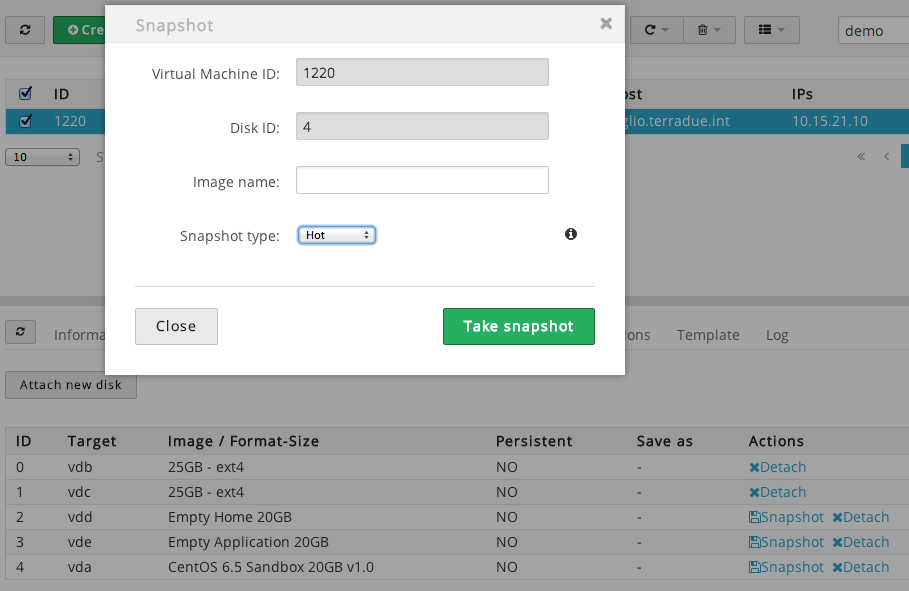

How to export a Terradue's Developer Cloud Sandbox to Interoute
===============================================================

Intended audience
-----------------

Anyone has the technical background to interact with *nix systems, BASH language, command line interfaces (CLI) and common network communication protocols.

Prerequisites
-------------

* To have root/admin permissions on the Sandbox,
* To have an Interoute account,
* To have installed the [qemu-img](http://wiki.qemu.org/Main_Page) tool for manipulating disk images.

Step 1. Preparation of the Sandbox
----------------------------------

This step prepares your Sandbox in terms OS configuration. Furthermore it makes the OS and the Application disks a single one disk (i.e. it copies all the content of the */application* mount point in the */* mount point). Before to start, please make sure that:

- The */application* contains only the needed stuff to be executed in Cluster mode (i.e. it is clean), 
- The */* has enough space to contain all the data of the */application* (If not, please contact the Operations Support  Team at Terradue).

If the previous facts are verified, proceed with the following steps:

* Login into the Sandbox,
* Type:
```bash
$ sh ./resources/scripts/ciop-sandbox-prepare.sh
```

Step 2. Snapshot of the OS disk
-------------------------------

* Login into the Cloud Controller,
* Make an **Hot** snapshot of the OS disk.



Step 3. Restore of the Sandbox
------------------------------

This step reverts the changes done after a successful *Step 1*. It is important if you want to use the Sandbox as Development environment after the snapshot done at *Step 2*.

* Login into the Sandbox,
* Type:
```bash
$ sh ./resources/scripts/ciop-sandbox-restore.sh
```

Step 4. Upload of the disk on Interoute
---------------------------------------

* Follow the walk through described [here](https://hub.interoute.com/VDCImageUpload/assets/ImageUploader/) (There is a PDF version in this repository, under *resources/pdf*).

*Note.* To upload your disk image, we suggest to:

* Use an FTP client (e.g. Cyberduck), using the provided *FTP: Secure One time directory* link,
* Use a connection with an high upload bandwidth (0.5 Mbps is not enough), otherwise your upload will be stuck during the process.

References
----------

1. [Interoute Image Importer FAQ and Walk through](https://hub.interoute.com/VDCImageUpload/assets/ImageUploader/)
